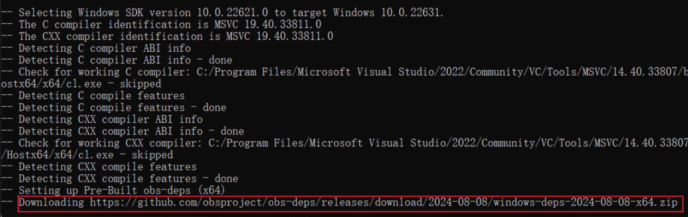
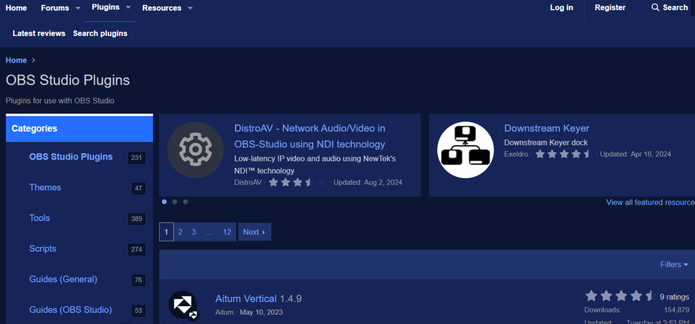

下面的描述基于 windows 操作系统。
### 1. 环境搭建
- 参考[官方文档](https://github.com/obsproject/obs-studio/wiki/build-instructions-for-windows)。在下载代码时一定要注意使用下面的方式，这样才能把 obs 的一些 plugin 全部 clone 下来，当然官方文档也有明确说明，这里只是强调一下。
<!-- truncate -->
```bash
git clone --recursive https://github.com/obsproject/obs-studio.git
```
- 在`cmake --preset windows-x64`环节可能会出现，下载三方依赖不能正常下载下来，这里有个比较好的方式就是拷贝这个 url（https://github.com/obsproject/obs-deps/releases/download/2024-08-08/windows-deps-2024-08-08-x64.zip） 到浏览器上，通过浏览器下载，然后将 zip 包拷贝到 obs-studio/deps 目录并解压，在重新执行 `cmake --preset windows-x64`命令即可，百试不爽~

- 当所有三方依赖都通过上面的方式下载完后，由于采用了非官方的方式，因此会出现工程配置失败的情况，这个时候需要在执行`cmake --preset windows-x64`命令之前，设置一个环境变量，用于指向 windows-deps、windows-deps-qt、cef 的目录
```bash
set CMAKE_PREFIX_PATH=C:\workspace\obs-studio\windows-deps;C:\workspace\obs-studio\windows-deps-qt6;C:\workspace\obs-studio\cef_binary_5060
```
### 2. 关于插件（plugin）
在 obs 的官网中，存在这样一个板块 [obs plugins](https://obsproject.com/forum/plugins/)，这里有许多网友们提供的插件，对obs 的能力进行了扩展。大部分插件都是开源的，一些好玩的功能可以直接使用插件或者参考实现。
